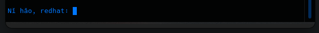
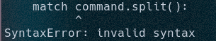

# 1CY-OSINT

This tool uses python3.10 

1CY-OSINT is the automated OSINT - Information gather tool made for every skill level.
It creates files for all the kinds of scans that it makes and writes them for easy viewability.

The CLI provides you with a hello message in verious differnt languages too.

Error ..
If you are getting the syntax error shown below, it's because you are using a python version too low. This tool uses python 3.10 and up.

